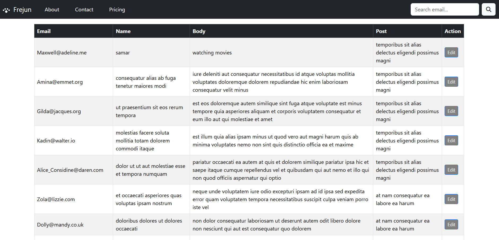

# React Comments SPA
## 📸 Demo

## hosted link
[Click here to view the app!](https://frejun-spa-ybe6.vercel.app/)

This project is a **Single Page Application (SPA)** built with **React + Vite**.  
It displays a paginated, searchable table of comments fetched from [jsonplaceholder.typicode.com](https://jsonplaceholder.typicode.com/).  
The project was built to complete an assignment, including bonus features for editing and persisting data.

## 🚀 **Features**
✅ Paginated table of comments (10 items per page)  
✅ Search bar in the navbar (filters by exact email match when the search button is clicked)  
✅ Displays:
- Email
- Name
- Body
- Title of the post associated with the comment  
✅ Clean, modern UI using **Bootstrap**  
✅ Editable fields:
- `Name` and `Body` can be edited in-place  
- Each row has an `Edit` / `Save` button
✅ **Edits persist after page refresh** using browser `localStorage`  
✅ Responsive navbar with:
- Logo on the left
- About, Contact, Pricing menu items in white with spacing
- Search bar on the right with a white search button containing a search icon

##  **Project structure**
src/
├── components/
│ ├── Navbar.jsx
│ └── CommentsPage.jsx
├── App.jsx
├── main.jsx
├── index.css
└── assets/
└── logo.png (local logo image)

### **Main Task (3 sub-tasks)**

#### **Sub-task 1:**
✔ Built with React (Vite).  
✔ Navbar created using Bootstrap, with search input on the right.  
✔ Table shows comments, paginated with `react-paginate`.

---

#### **Sub-task 2:**
> Table must have the following columns:
> - Email
> - Name
> - Body
> - Post (the title of the post the comment is for)

✔ Fetched comments data (`/comments` endpoint): includes Email, Name, Body.  
✔ Fetched posts data (`/posts` endpoint): used `postId` to map to post title.  
✔ Displayed all required columns.

---

#### **Sub-task 3:**

✔ Search bar in the navbar.  
✔ Filters comments by **exact email match** (case-insensitive).  
✔ Triggered **only** when user clicks the search button (with a search icon).  
✔ Does not search in name/body/post title (by design).

---

### 🌟 **Bonus tasks (2 sub-tasks)**

#### **Sub-task 4 (Bonus):**

✔ Added an **Edit** button for each row.  
✔ Clicking Edit:
- Turns Name and Body into editable input/textarea.
- Button label changes to **Save**.

---

#### **Sub-task 5 (Bonus):**

✔ Used browser's **localStorage** to save edits.  
✔ On page load, load edits from localStorage and merge over fetched data.  
✔ Edits appear again after refresh; no backend needed.

---

## ✨ **Extra touches we added:**
- Navbar:
  - Logo on the far left (white).
  - About, Contact, Pricing links (pure white, spaced apart with `mx-2`).
  - Search bar on the right with white button containing a search icon.
- Edit button styled grey with white text (`background: grey; color: white`).
- Clean, responsive Bootstrap UI.

---
## ⚙ **Tech & tools**
- React 18
- Vite
- Axios
- React Router DOM
- React Paginate
- Bootstrap 5
- Font Awesome (for search icon)

# Clone project (or unzip)
cd project-folder

# Install dependencies
npm install

# Start development server
npm run dev